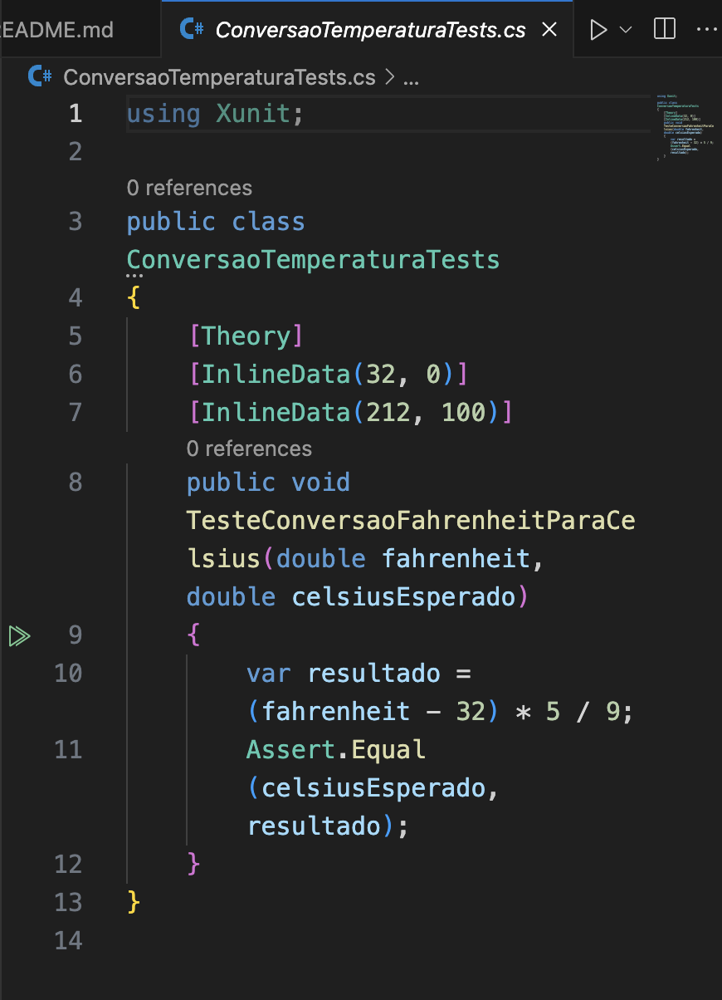
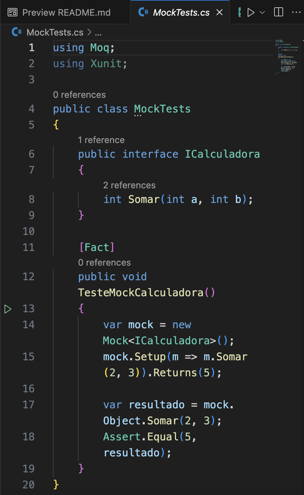
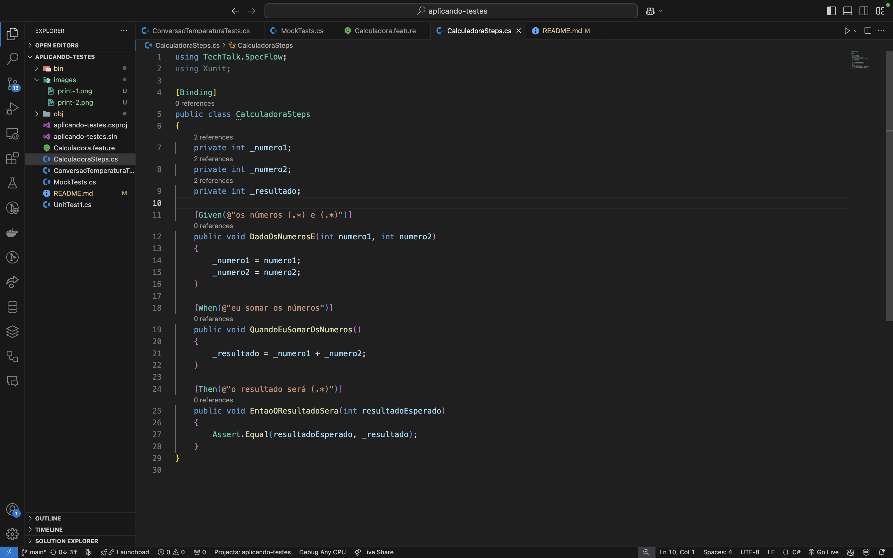
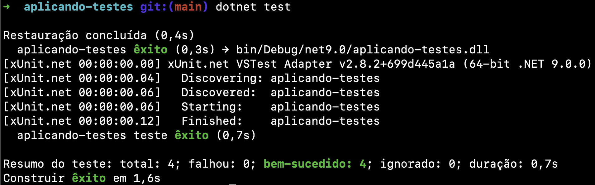

# ponderada_teste_de_integracao

Este repositório contém exemplos de aplicação de diferentes tipos de testes em um projeto .NET 5, conforme o tutorial de autoestudo.

## Tipos de Testes Implementados
### 1. Testes de Unidade com xUnit
**Descrição:** Testes de unidade validam partes isoladas do código, garantindo que métodos funcionam conforme o esperado.

**Exemplo de Aplicação:**
- Conversão de temperaturas de Fahrenheit para Celsius.
- Cálculo baseado na fórmula: `(fahrenheit - 32) * 5 / 9`.

**Cenários:**
1. Entrada: 32°F → Esperado: 0°C.
2. Entrada: 212°F → Esperado: 100°C.

**Print do teste:**


---

### 2. Testes de Mocking com Moq
**Descrição:** Simula o comportamento de dependências externas, como serviços, permitindo testar a lógica sem a necessidade de implementação real.

**Exemplo de Aplicação:**
- Teste para somar dois números utilizando um mock de calculadora.

**Cenários:**
1. Entrada: Soma de 2 e 3 → Esperado: 5.
2. Entrada: Soma de 10 e -5 → Esperado: 5.

**Print do teste:**


---

### 3. Testes BDD com SpecFlow
**Descrição:** Testes BDD (Behavior Driven Development) validam funcionalidades de alto nível usando histórias de usuário. Escrevemos cenários em linguagem natural que conectam diretamente com passos implementados em C#.

**Exemplo de Aplicação:**
- Cenário para somar dois números.

**Cenários:**
1. **Cenário 1:** Soma de números positivos:
   - **Dado**: os números 2 e 3.
   - **Quando**: eu somar os números.
   - **Então**: o resultado será 5.
2. **Cenário 2:** Soma de números com sinais diferentes:
   - **Dado**: os números 10 e -5.
   - **Quando**: eu somar os números.
   - **Então**: o resultado será 5.

**Print do teste:**



## Execução dos Testes
Para executar os testes:
```bash
dotnet test
```
